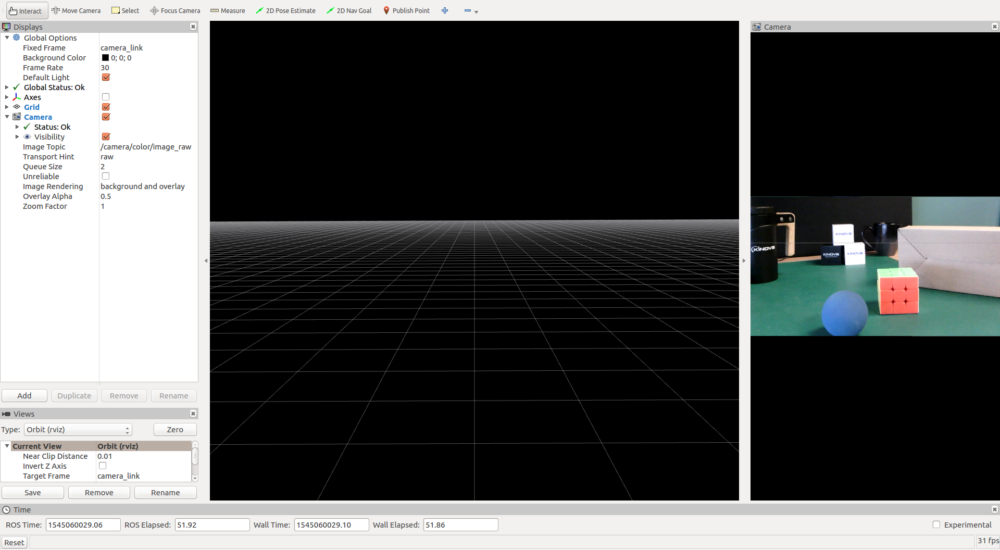
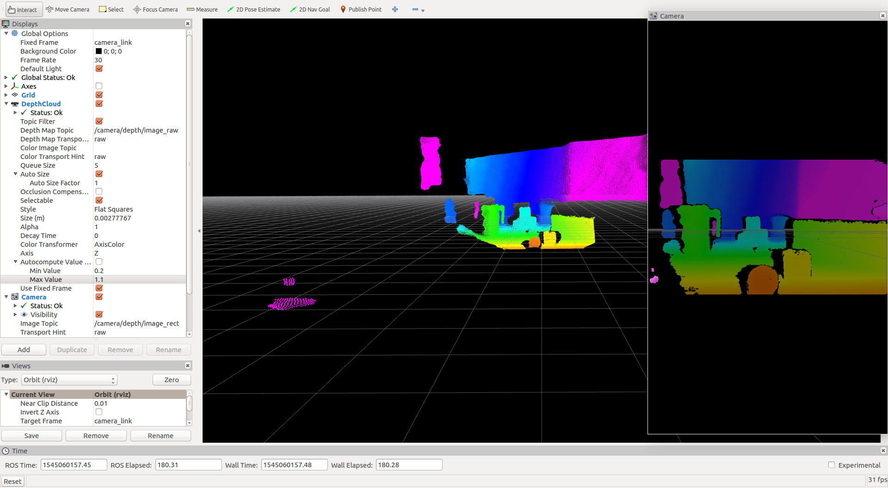
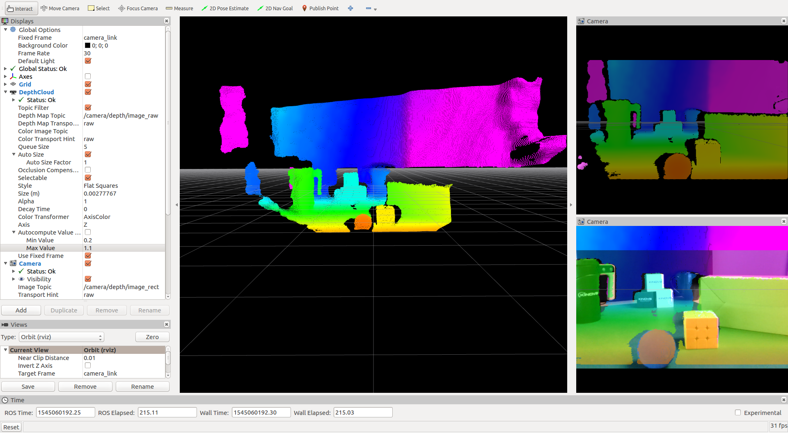
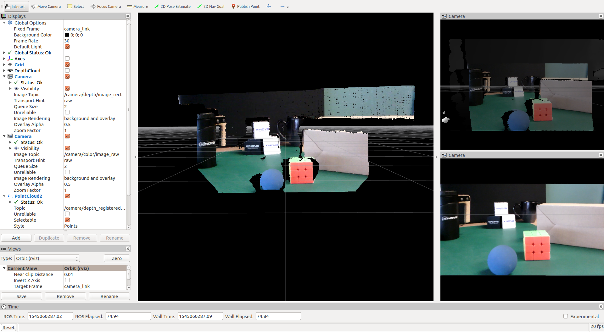

# Kinova Vision module package

## Overview
This ROS package provides helper methods and launch scripts to access the Kinova Vision module depth and color streams.


## Installation (using catkin)
The following instructions are for ROS Kinetic Kame, running under **Ubuntu 16.04**

### Building from Source

#### Dependencies

##### GStreamer packages
* gstreamer1.0-tools
* libgstreamer1.0-libav
* libgstreamer1.0-dev 
* libgstreamer-plugins-base1.0-dev 
* libgstreamer-plugins-good1.0-dev
* gstreamer1.0-plugins-good
* gstreamer1.0-plugins-base

```sh
sudo apt install gstreamer1.0-tools gstreamer1.0-libav libgstreamer1.0-dev libgstreamer-plugins-base1.0-dev libgstreamer-plugins-good1.0-dev gstreamer1.0-plugins-good gstreamer1.0-plugins-base
```

##### ROS package
* rgbd_launch

```bash
sudo apt-get install ros-kinetic-rgbd-launch
```

#### Building

To build from source, clone the latest version from this repository into your catkin workspace and compile the package.

1. Create a catkin workspace
```bash
mkdir -p ~/catkin_ws/src
cd ~/catkin_ws/src/
```
2. Clone this git repo into `~/catkin_ws/src`
```bash
git clone https://github.com/Kinovarobotics/ros_kortex_vision.git
```
```bash
cd ~/catkin_ws/src/
catkin_init_workspace 
cd ..
catkin_make clean
catkin_make
catkin_make install
echo "source ~/catkin_ws/devel/setup.bash" >> ~/.bashrc
source ~/.bashrc
```

## Usage

### Start roscore (if not already started)
```bash
roscore
```

### Start kinova_vision node
```bash
roslaunch kinova_vision kinova_vision.launch
```
Refer to the [Launch files](#launch_files) section to see the available launch files.

### Start rviz to view both cameras

```bash
rosrun rviz rviz
```

Refer to the [Rviz configuration files](#rviz_config_files) section to see the configuration files for viewing streams in rviz.

### Alternatively, use [image_view] to view a camera stream:

```bash
rosrun image_view image_view image:=/camera/color/image_raw
rosrun image_view image_view image:=/camera/depth/image_raw
```

The `image` argument specifies the image topic to subscribe to.

Refer to the [Nodes](#nodes) section to see the published topics using the message type [sensor_msgs/Image].

<a name="launch_files"></a>
## Launch files

* **kinova_vision.launch:** Connect to both the color and the depth camera streams and publish their images as well as the depth point cloud data.

     arguments:

    - **`device`** device IP address (default: `192.168.1.10`)
    - **`num_worker_threads`** number of worker threads for the nodelet manager (default: `4`)
    - **`camera_link_frame_id`** camera link frame identifier (default: `camera_link`)
    - **`color_frame_id`** color camera frame identifier (default: `camera_color_frame`)
    - **`depth_frame_id`** depth camera frame identifier (default: `camera_depth_frame`)
    - **`color_camera_info_url`** URL of color camera custom calibration file (see [camera_info_manager] documentation for calibration URL details)
    - **`depth_camera_info_url`** URL of depth camera custom calibration file (see [camera_info_manager] documentation for calibration URL details)

* **kinova_vision_rgbd.launch:** Connect to both the color and the depth camera streams and publish their images as well as the depth point cloud data with color information.

     arguments:

    - **`device`** device IP address (default: `192.168.1.10`)
    - **`num_worker_threads`** number of worker threads for the nodelet manager (default: `4`)
    - **`camera_link_frame_id`** camera link frame identifier (default: `camera_link`)
    - **`color_frame_id`** color camera frame identifier (default: `camera_color_frame`)
    - **`depth_frame_id`** depth camera frame identifier (default: `camera_depth_frame`)
    - **`color_camera_info_url`** URL of color camera custom calibration file (see [camera_info_manager] documentation for calibration URL details)
    - **`depth_camera_info_url`** URL of depth camera custom calibration file (see [camera_info_manager] documentation for calibration URL details)

* **kinova_vision_color_only.launch:** Connect to the color camera stream only and publish its images.

     arguments

    - **`device`** device IP address (default: `192.168.1.10`)
    - **`num_worker_threads`** number of worker threads for the nodelet manager (default: `4`)
    - **`camera_link_frame_id`** camera link frame identifier (default: `camera_link`)
    - **`color_frame_id`** color camera frame identifier (default: `camera_color_frame`)
    - **`color_camera_info_url`** URL of color camera custom calibration file (see [camera_info_manager] documentation for calibration URL details)

* **kinova_vision_depth_only.launch:** Connect to the depth camera stream only and publish its images as well as the depth point cloud data.

     arguments

    - **`device`** device IP address (default: `192.168.1.10`)
    - **`num_worker_threads`** number of worker threads for the nodelet manager (default: `4`)
    - **`camera_link_frame_id`** camera link frame identifier (default: `camera_link`)
    - **`depth_frame_id`** depth camera frame identifier (default: `camera_depth_frame`)
    - **`depth_camera_info_url`** URL of depth camera custom calibration file (see [camera_info_manager] documentation for calibration URL details)

### Specifying launch options
It's possible to override the default argument values when launching the **kinova_vision** node.

Arguments are set using the following syntax: `<argument>:=<value>`.

For instance, the default value of the `device` argument can be overridden to specify another IP address.
```bash
roslaunch kinova_vision kinova_vision_rgbd.launch device:=10.20.0.100
```
#### Additional information on arguments `color_camera_info_url` and `depth_camera_info_url`

These arguments specify the custom camera information file to use instead of the default camera information file.

The file is specified via a specific URL syntax, using either of these two formats:

`package://<package_name>/relative/path/to/file`

`file:///absolute/path/to/file`

For example:
```bash
roslaunch kinova_vision kinova_vision_rgbd.launch color_camera_info_url:=file:///home/user/custom_color_calib_1280x720.ini depth_camera_info_url:=file:///home/user/custom_depth_calib_480x270.ini
```

A custom camera information file is typically created from a default information file (refer to *launch/calibration/default_\*.ini*). Then, one simply needs to adjust the proper matrices.

The following matrices need to be adjusted with the proper values for `FX`, `FY`, `PPX`, `PPY`:
```
camera matrix
FX 0.00000 PPX
0.00000 FY PPY
0.00000 0.00000 1.00000

projection
FX 0.00000 PPX 0.00000 
0.00000 FY PPY 0.00000 
0.00000 0.00000 1.00000 0.00000 
```

The values for `FX`, `FY`, `PPX`, `PPY` can be obtained via the Vision module API. They represent the _focal length_ and the _principal point offset_ in both the _x_ and _y_ coordinates.

<a name="rviz_config_files"></a>
## Rviz configuration files

* **color_only.rviz:** View the images coming from the color camera only. The package needs to be launched with *kinova_vision_color_only.launch*, *kinova_vision.launch* or *kinova_vision_rgbd.launch*.

<p align="left">  </p>

* **depth_only.rviz:** View the images and the depth cloud coming from the depth camera only. The package needs to be launched with *kinova_vision_depth_only.launch*, *kinova_vision.launch* or *kinova_vision_rgbd.launch*.

<p align="left">  </p>

* **depth_and_color.rviz:** View the images coming from the color camera as well as the images and the depth cloud coming from the depth camera. The package needs to be launched with *kinova_vision.launch* or *kinova_vision_rgbd.launch*.

<p align="left">  </p>

* **depth_and_color_rgbd.rviz:** View the images coming from the color camera as well as the images, the RGBD point cloud and the depth cloud coming from the depth camera. The package needs to be launched with *kinova_vision_rgbd.launch*.

<p align="left">  </p>

<a name="nodes"></a>
## Nodes

### kinova_vision_color

This node publishes the raw stream and the meta information of the color camera.

#### Subscribed Topics

None

#### Published Topics

* **`/camera/color/camera_info`** ([sensor_msgs/CameraInfo])

    Color camera calibration and meta information.

* **`/camera/color/image_raw`** ([sensor_msgs/Image])

    Color camera raw image (RGB8 encoding).

### kinova_vision_depth

This node publishes the raw stream and the meta information of the depth camera.

#### Subscribed Topics

None

#### Published Topics

* **`/camera/depth/camera_info`** ([sensor_msgs/CameraInfo])

    Depth camera calibration and meta information

* **`/camera/depth/image_raw`** ([sensor_msgs/Image])

    Depth camera raw image (millimeters - 16UC1 encoding).

### camera_color_tf_publisher

This node publishes the static coordinate transformation between the color camera frame (*camera_color_frame*) and the camera link frame (*camera_link*).

#### Subscribed Topics

None

#### Published Topics

* **`/tf_static`** ([tf2_msgs/TFMessage])

    Color camera frame static transformation

### camera_depth_tf_publisher

This node publishes the static coordinate transformation between the depth camera frame (*camera_depth_frame*) and the camera link frame (*camera_link*).

#### Subscribed Topics

None

#### Published Topics

* **`/tf_static`** ([tf2_msgs/TFMessage])

    Depth camera frame static transformation


### camera_nodelet_manager

This node uses [rgbd_launch] package to create a nodelet graph, transforming raw data from the device driver into point clouds, rectified images, and other products suitable for processing and visualization.

#### Subscribed Topics

* **`/camera/color/camera_info`** ([sensor_msgs/CameraInfo])

    Color camera calibration and meta information

* **`/camera/color/image_raw`** ([sensor_msgs/Image])

    Color camera raw image

* **`/camera/depth/camera_info`** ([sensor_msgs/CameraInfo])

    Depth camera calibration and meta information

* **`/camera/depth/image_raw`** ([sensor_msgs/Image])

    Depth camera raw image

#### Published Topics

* **`/camera/color/image_rect_color`** ([sensor_msgs/Image])

    Color rectified image (RGB8 encoding)

* **`/camera/depth/image`** ([sensor_msgs/Image])

    Depth image (meters - 32FC1 encoding)

* **`/camera/depth/image_rect`** ([sensor_msgs/Image])

    Depth rectified image (meters - 32FC1 encoding)

* **`/camera/depth/image_rect_raw`** ([sensor_msgs/Image])

    Depth rectified image (millimeters - 16UC1 encoding)

* **`/camera/depth/points`** ([sensor_msgs/PointCloud2])

    Depth camera point cloud data

* **`/camera/depth_registered/points`** ([sensor_msgs/PointCloud2])

    Depth camera point cloud data with color information (RGBD)


[image_view]: http://wiki.ros.org/image_view
[camera_info_manager]: http://wiki.ros.org/camera_info_manager
[sensor_msgs/CameraInfo]: http://docs.ros.org/api/sensor_msgs/html/msg/CameraInfo.html
[sensor_msgs/Image]: http://docs.ros.org/api/sensor_msgs/html/msg/Image.html
[sensor_msgs/PointCloud2]: http://docs.ros.org/api/sensor_msgs/html/msg/PointCloud2.html
[tf2_msgs/TFMessage]: http://docs.ros.org/api/tf2_msgs/html/msg/TFMessage.html
[rgbd_launch]: http://wiki.ros.org/rgbd_launch
