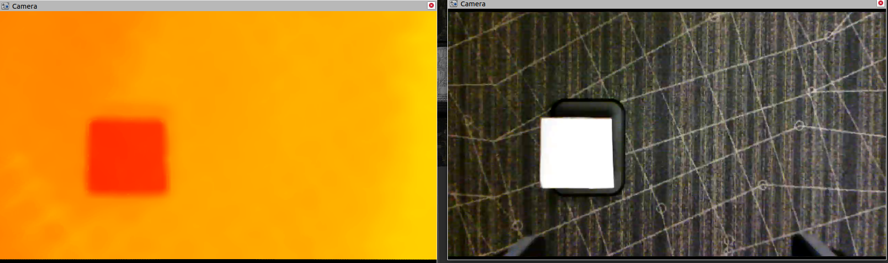

# CV Calibration V1.2.0
<a id="md-description" name="description"></a>
## Description
This ROS package is made to be used in combination with [ros_kortex_vision](https://github.com/Kinovarobotics/ros_kortex_vision) package to provide a way to easily calibrate the color and depth camera streams. The calibration will however only be visible using [RViz](http://wiki.ros.org/rviz) or any visualizer that can listen to the static transforms topic to offset the point cloud data from the depth stream.
This was meant as a solution for [Issue #1](https://github.com/Kinovarobotics/ros_kortex_vision/issues/1)

<a id="md-description" name="contents"></a>
## Table of contents
- [Description](#description)
- [Table of contents](#contents)
- [Requirements](#Requirements)
- [Installation](#Installation)
    - [Build](#Build)
- [Usage](#Usage)
    - [Running the program](#run)
        - [Using the program](#use)
            - [Configuring rviz](#conf-rviz)
            - [Configuring streams](#conf-streams)
            - [Calibrating](#Calibrating)
            - [Saving the values](#save)
        - [Edge cases](#edgecases)
            - [Intrusions in depth](#intrusions)
            - [Pressing keys don’t change the values / write in the terminal](#edgekeys)
            - [Camera streams stop working after a while](edgecamstop)
            - [The square is never detected](#edgesquare)
- [Patch notes](#patch-notes)            


## Requirements
This project was designed to be achievable by anyone using things you can find or make easily.
You will need:
- A flat rectangular object. It has to be of a uniform color. For better results, it has to be brighter than your background. Optionnally you can use a flashlight to make it brighter to the camera. This is needed for the color shape detection.
- A way to hold this object at a distance from the background. If whatever you are using to hold the object in place is thin enough, you will be able to filter it out using the program.
- A dark (or darker than the object used for calibration) background.

As mentionned, this setup does not need to be fancy. The setup used for testing this program was made of a heavy base plate, two clamps, a cardboard square (any rectangular shape will do) covered with a white paper sheet, and some tape to hold everything together.

## Installation
This guide assumes you have already used and built the [ros_kortex_vision](https://github.com/Kinovarobotics/ros_kortex_vision) library. This means you need to install ROS and make a catkin workspace. If you haven't done so already, go to the ros_kortex_vision repo and follow the installation steps, and then come back here.

### Build
These are the steps to build the project:
```sh
cd ~/<catkin_workspace>/src
git clone https://github.com/IlianaKinova/cv_calibration.git
python3 -m pip install -r cv_calibration/requirements.txt
cd ../
```

Now, for the the first time only, you will need to make the project:
```sh
catkin_make
```

And now you can source your workspace:
```sh
source devel/setup.bash
```
This step is needed in every new terminal you open and want to run the code.

## Usage
<a id="md-run" name="run"></a>
### Starting vision driver
You need to have the kinova_vision running before for the program to execute properly
Note: you need to launch the kinova_vision_rgbd.launch
```sh
roslaunch kinova_vision kinova_vision_rgbd.launch 
```  
<a id="md-run" name="run"></a>
### Running the program
To run the program, make sure you are in your catkin workspace directory and make sure you have sourced your project ([see Build](#Build)). Start the kinova_vision_rgbd driver from [ros_kortex_vision](https://github.com/Kinovarobotics/ros_kortex_vision#usage). Open RViz using:
```sh
rviz
```
And now you can launch the program:
```sh
roslaunch cv_calibration rviz_calibration.launch
```

<a id="md-use" name="use"></a>
### Using the program
Here is the simplest walkthrough. If you encounter any issues along the way see [here](#edgecases) and then come back here.
<a id="md-conf-rviz" name="conf-rviz"></a>
#### Configuring rviz
The program will ask you to open rviz. Open rviz and continue.
Then it will ask you to open the config file found in the rviz directory of the package.
Once open, you can setup your windows.
Activate both camera viewers and find the one that contains the depth data. It will most likely look something like this:
<p align="left">  </p>

Now, go to the DepthCloud properties and under Autocompute Value Bounds, tweak with the min and max values until you get something a little more like this:
<p align="left">  </p>
In the current case, a min value of 0.76 and a max value of 2 were used.

Next, put the windows side by side like so:
<p align="left">  </p>

Now you can continue to teach the program what windows to capture.
Press enter (in the terminal) until you see a message asking you to select the color camera viewer. Press enter and click on the color camera viewer. Go back to the terminal and do it once more for the depth camera viewer.

<a id="md-conf-streams" name="conf-streams"></a>
#### Configuring streams
Now a few windows will open. It may seem overwhelming at first but start by locating the window called "color". You will notice on the top left, that it says `thresh: Up:'w' Down:'s'`. This is to adjust the threshold of the filter. If the light blue square does not show or is not finding the calibration object, locate the window called "color_filter" and use the 'w' and 's' keys to adjust the threshold until you see a well defined shape. You can validate if it is good enough by looking at the "color" window and checking if the light blue circles align with the rectangular shape like so:
<p align="left">  </p>

Now you can locate the window called "depth". You will notice that it says you can use the 'e' and 's' keys to adjust the threshold. Just like with the color window, locate the window named "depth_filter" and adjust the threshold until you see a clean shape. The filtering of the edge detection should be pretty good at ignoring intrusions. In the end, it should look something like this:
<p align="left">  </p>

#### Calibrating
Now you are ready to calibrate the streams. Locate the window called "Debug". Here you will see debug information. The xOffset, yOffset and zOffset fields describe the relative offset from the middle as well as the relative size of both of the rectangles found by the edge detection. Anything below 0.02 is good enough.
To start calibrating, press and hold 'c'. You will start to see the depth stream moving as it attempts to correct the offsets.
BEWARE, the z calibration added some issues where when the z calibrator moves, it can sometimes lose tracking. You may want to keep the depth_filter window up to make sure the calibration object is still visible. Adjust the depth threshold if this happens.
Wait until you are satisfied with the calibration (you can stop at any time and continue later). You can see a preview in rviz using the PointCloud2. In the end, it should look something like this:
<p align="left">  </p>

This screenshot was taken by turning off the DepthCloud and changing the PointCloud2 settings to use Squares with a smaller size.

<a id="md-save" name="save"></a>
#### Saving the values
At this point you can select the debug window and press 'z'. This will save the values in the Result.txt file located in `cv_calibration/resources`. The x y z values are what need to be put in the kortex vision launch file
[here](https://github.com/Kinovarobotics/ros_kortex_vision/blob/fb76366262c90cf735321ca81b005ee8171af487/launch/kinova_vision_rgbd.launch#L97).
You can also press 'x' to reset the calibration (the offset will update the next time you press 'c').

<a id="md-edgecases" name="edgecases"></a>
### Edge cases
Here are some issues you may run into.
<a id="md-intrusions" name="intrusions"></a>
#### Intrusions in depth
<p align="left">  </p>

This should now be way easier to fix and should almost never occur anymore, if it does, try moving your calibration object so it is centered in the frame. Otherwise, try to clear the area or move the camera elsewhere.
<a id="md-edgekeys" name="edgekeys"></a>
#### Pressing keys don't change the values / write in the terminal
If a key is indicated on the terminal, you should write in the terminal. If a key is indicated in a window, then you need to select any of the program's window (excluding the terminal) and press the keys then.
<a id="md-edgecamstop" name="edgecamstop"></a>
#### Camera streams stop working after a while
Your computer may be overloaded, try decreasing the fps on RViz or closing some apps that may be intensive on your cpu. You could also stop the PointCloud2 component in RViz.
<a id="md-edgesquare" name="edgesquare"></a>
#### The square is never detected
Make sure your shape is well oriented with the camera. One of the ways to filter the shapes is to find out how much of the bounding box covers the actual ite, if the shape is angled, the there will be some uncovered areas in the corners of the bounding box.

<a id="md-patch-notes" name="patch-notes"></a>
## Patch notes
### V1.1.0
- Improved the edge detection.
- Added filterng of the detected objects.
### V1.2.0
- Improved edge detection.
- Added calibration of the z axis.
- An issue can happen during calibration where the z calibration will require you to adjust the depth threshold (see [Calibrating](#Calibrating))
